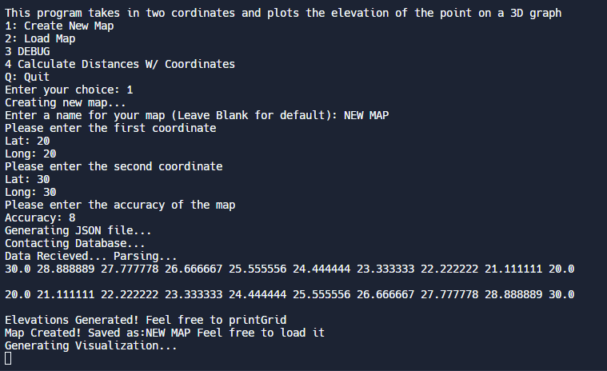
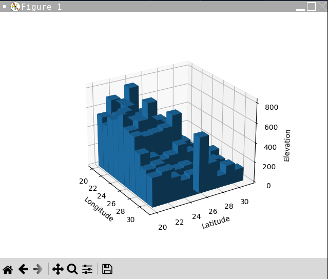
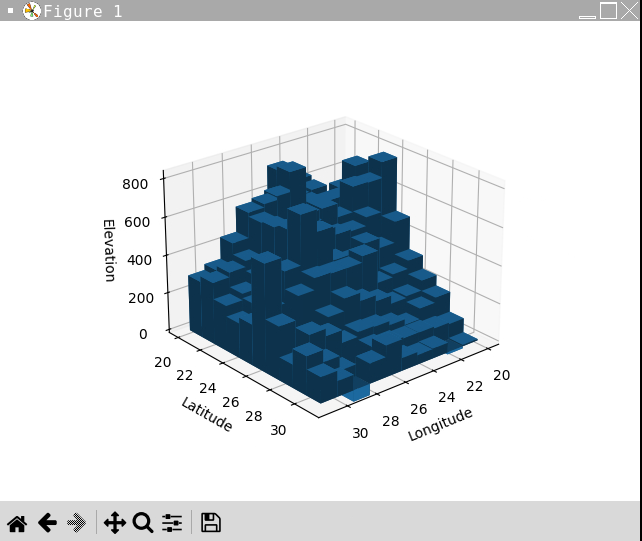

# Elevation-Project
Python project that interacts with the Open-Elevation API to process elevation data. Uses matplotlib to generate easy to understand elevation maps. Elevatons are in meters from sea level. Coordinates are in decimal format up to 6 significant digits.

Here's an example of grabbing the elevation map from 20°N 20°E to 30°N 30°E

